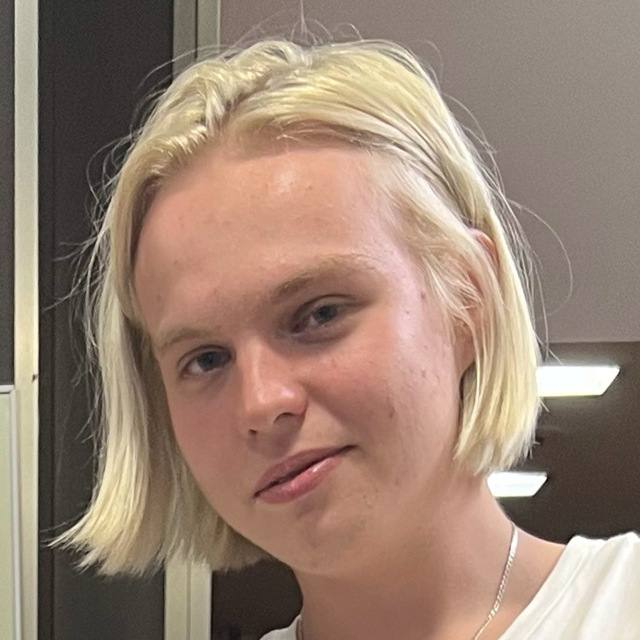

# Привет, меня зовут Олег

## Обо мне
Я - Олег, студент 3 курса УГНТУ с большим интересом к технологиям, программированию и дизайну. Я люблю изучать новые вещи и создавать креативные проекты.

## Мои навыки
- Программирование 
- Дизайн )
- Анализ данных
- Работа с базами данных
- Проектный менеджмент

## Связаться со мной
- Email: [ovtvta@mail.ru]
- telegram : [Guvhy]

## Благодарности
Спасибо, что уделили внимание моему профилю! Дайте знать, если у вас есть вопросы или предложения по сотрудничеству
